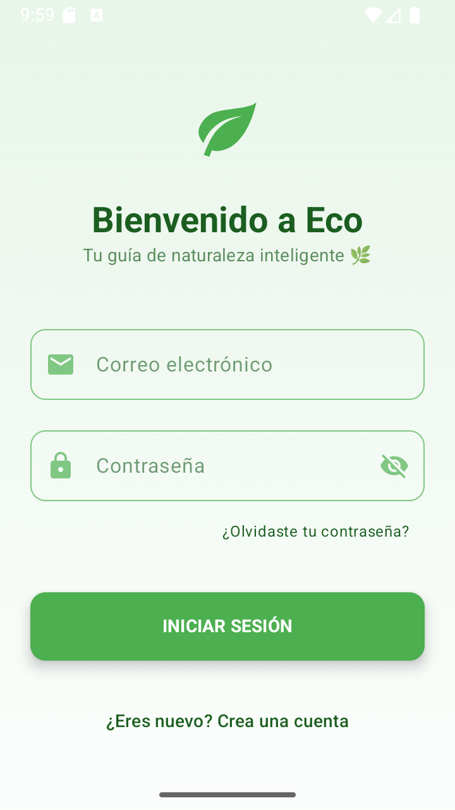
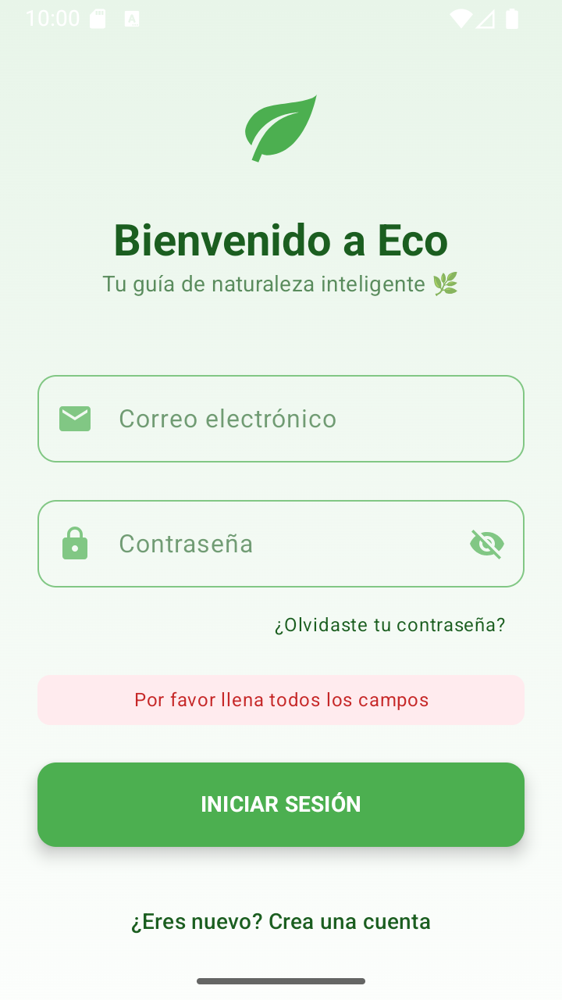
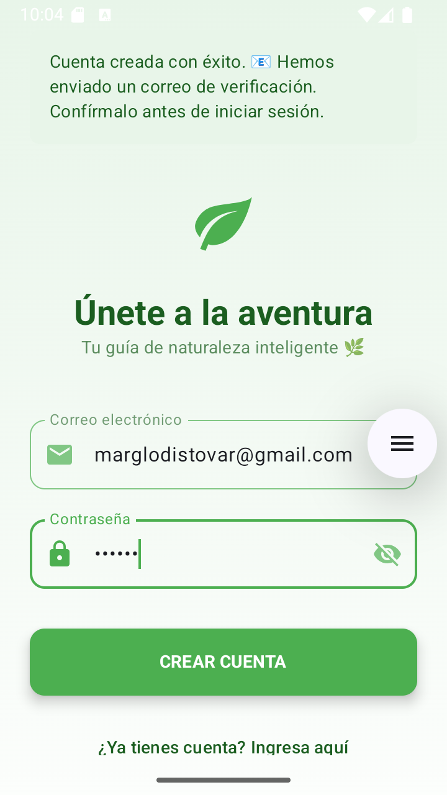
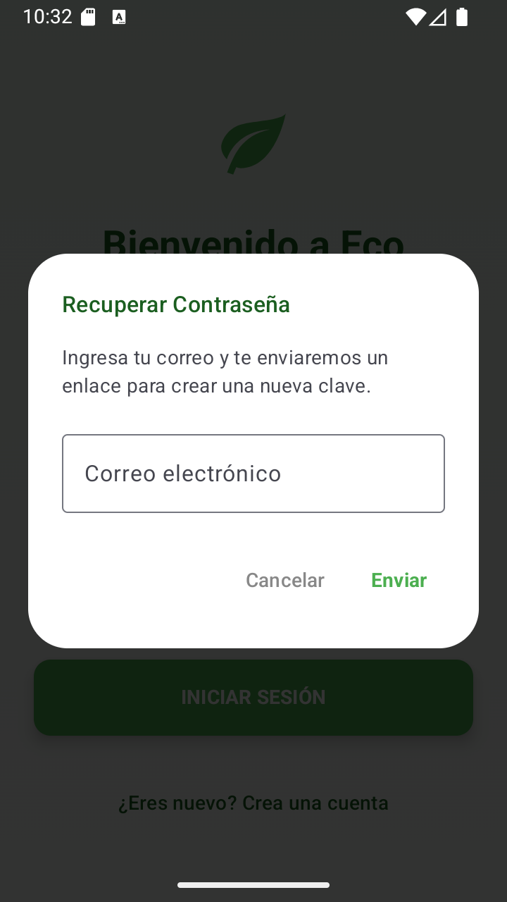
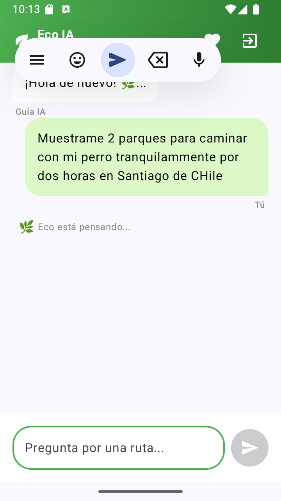
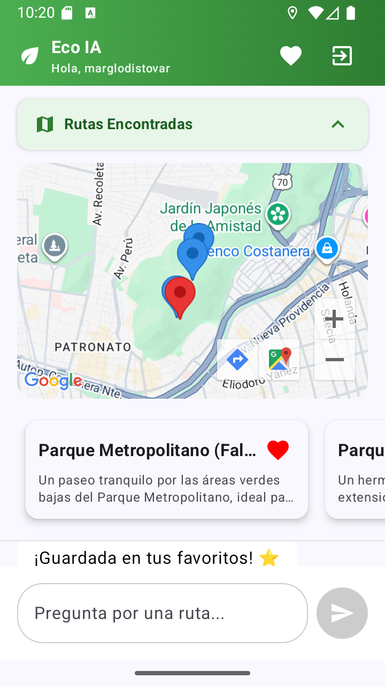
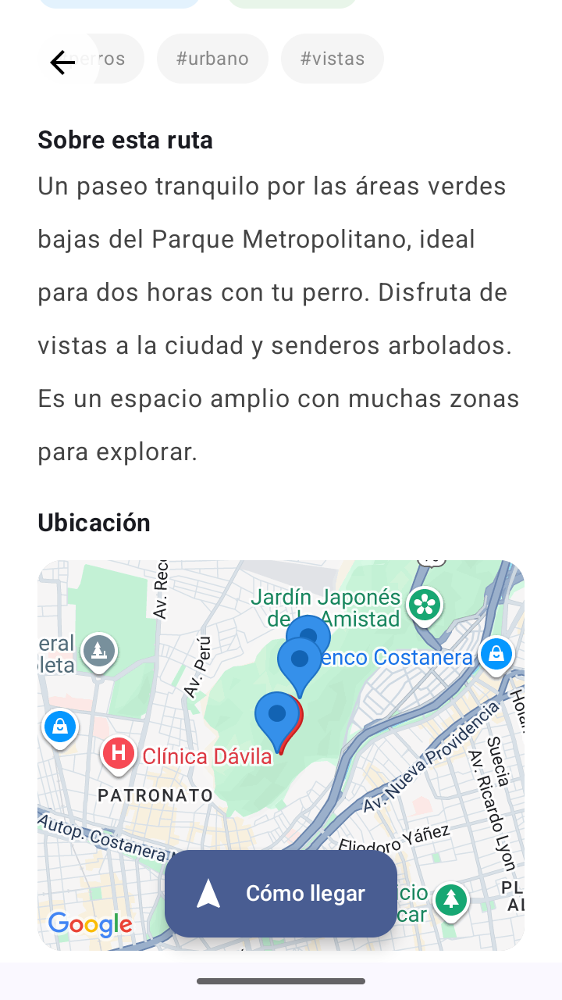
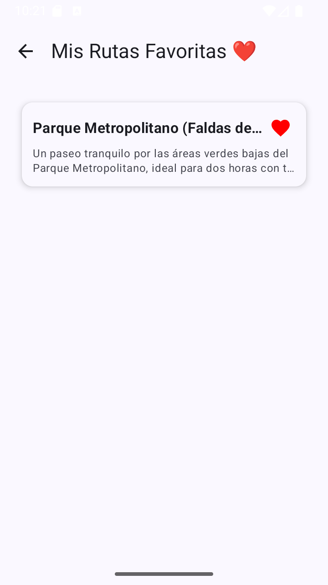
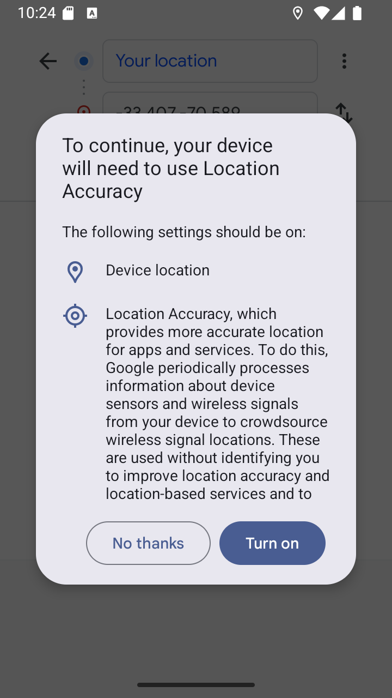
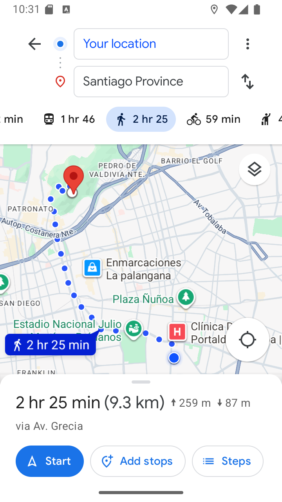

# 🌿 Rutas Locales IA (Eco)


Bienvenido al repositorio de **Rutas Locales IA ("Eco")**, un asistente de senderismo inteligente desarrollado en Android Nativo.

Esta aplicación revoluciona la búsqueda de rutas naturales combinando la potencia de la **IA Generativa (Google Gemini)** con la precisión de **Google Maps**. Olvídate de los filtros técnicos complejos; simplemente dile a Eco lo que buscas y él encontrará la aventura perfecta para ti.

---
<p align="center">
  
</p>
---

## 📱 Galería de la Aplicación

### 🔐 Autenticación Segura
Flujo completo con registro, validación de correo y recuperación de contraseña.

|                  Splash & Bienvenida                   | Inicio de Sesión | Registro & Validación | Recuperación Clave |
|:------------------------------------------------------:|:---:|:---:|:---:|
|  |  |  |  |

### 🤖 Chat IA & Mapas Interactivos
Interacción conversacional natural y visualización geográfica inmediata.

| Chat con Eco |                   Resultados en Mapa                   | Detalle de Ruta | Favoritos |
|:---:|:------------------------------------------------------:|:---:|:---:|
|  |  |  |  |

### 🧭 Navegación y Permisos
Integración nativa con Google Maps Navigation y gestión responsable de permisos.

| Solicitud Permisos |                     Navegación GPS                     |
|:---:|:------------------------------------------------------:|
|  |  |

--- 
## 📺 Video Demo

¿Quieres ver a Eco en acción? Mira la demostración completa de la app funcionando:

[](https://youtu.be/qGHPTm6cKLs)

*(Haz clic en la imagen para ver el video)*

---

## ✨ Funcionalidades Clave

* **💬 Asistente Conversacional:** Integración con **Gemini API** para entender lenguaje natural (ej: *"Quiero una ruta tranquila para ir con mi perro"*).
* **🗺️ Mapas Dinámicos:** Visualización de rutas con **Google Maps SDK** y marcadores interactivos.
* **🔐 Seguridad Robusta:** Implementación de **Firebase Auth** con verificación de email obligatoria.
* **❤️ Favoritos Offline:** Persistencia de datos locales con **Room Database**, segregada por usuario.
* **🎨 UI Moderna:** Interfaz construida 100% con **Jetpack Compose** y Material Design 3.

---

## 🛠️ Stack Tecnológico (MAD)

La aplicación sigue los estándares de **Modern Android Development**:

| Capa | Tecnología |
| :--- | :--- |
| **Lenguaje** | Kotlin |
| **UI Framework** | Jetpack Compose (Material 3) |
| **Arquitectura** | MVVM + Clean Architecture |
| **Inyección Dep.** | Dagger Hilt |
| **IA & LLM** | Google Gemini API (Generative AI) |
| **Mapas** | Google Maps SDK for Android |
| **Backend/Auth** | Firebase Authentication |
| **Base de Datos** | Room (SQLite) |
| **Red & Async** | Retrofit, Coroutines & Flow |
| **Imágenes** | Coil |

---

## ⚙️ Instrucciones de Instalación y Configuración

Como medida de seguridad, las claves API personales **no se incluyen** en este archivo comprimido. Debes configurar tus propias claves para que la aplicación funcione correctamente.

Sigue estos pasos:

### 1. Descomprimir y Abrir
1.  Descomprime el archivo `.zip` en una carpeta de tu preferencia.
2.  Abre Android Studio.
3.  Selecciona **File > Open** y busca la carpeta del proyecto descomprimido.

### 2. Configurar API Keys (Importante 🔑)
La aplicación busca las claves en un archivo de configuración local que no se comparte. Debes crearlo manualmente:

1.  En la vista de proyecto de Android Studio (a la izquierda), asegúrate de estar en la vista **Project** (no Android).
2.  Busca el archivo llamado `local.properties` en la raíz del proyecto.
    * **Si no existe, crea un nuevo archivo de texto con ese nombre exacto.**
3.  Abre el archivo y pega tus claves con el siguiente formato (sin comillas):

    ```properties
    sdk.dir=C\:\\Users\\TuUsuario\\AppData\\Local\\Android\\Sdk
    MAPS_API_KEY=Pega_Aqui_Tu_Clave_De_Maps
    GEMINI_API_KEY=Pega_Aqui_Tu_Clave_De_Gemini
    ```
    
    (Nota: La línea sdk.dir suele generarse sola al abrir Android Studio, pero asegúrate de añadir las dos líneas de abajo con tus claves reales).
    (Nota: La línea sdk.dir suele generarse sola al abrir Android Studio, pero asegúrate de añadir las dos líneas de abajo con tus claves reales).
### 3. Configurar Firebase (google-services.json) 🔥
Dado que la app utiliza Firebase Auth, necesitas vincularla a tu propio proyecto de Firebase:
1. Ve a la Consola de Firebase.

2. Crea un proyecto y agrega una app Android con el paquete: com.mtovar.rutaslocalesia (verifica el paquete en tu build.gradle).

3. Descarga el archivo google-services.json.

4. Mueve ese archivo a la carpeta app/ dentro de tu proyecto (al mismo nivel que el build.gradle del módulo app).

5. Habilita Authentication (Email/Password) en la consola.

### 4. Sincronizar y Ejecutar
1. Haz clic en el botón "Sync Project with Gradle Files" (el icono del elefante o las flechas circulares) en la barra superior.

2. Espera a que termine la configuración.

3. Selecciona un emulador (se recomienda Pixel con API 33+) o conecta tu dispositivo físico.

4. Dale al botón Run (▶️).

# 🛠️ Stack Tecnológico
+ Lenguaje: Kotlin
+ UI: Jetpack Compose (Material 3)
+ Arquitectura: MVVM + Clean Architecture
+ Inyección de Dependencias: Dagger Hilt
+ Persistencia: Room Database & Firebase Auth
+ Conectividad: Retrofit & Coroutines

# 📝 Notas Adicionales
+ Ubicación en Emulador: Si usas el emulador, recuerda establecer una ubicación GPS (ej. Santiago, Chile) en los ajustes del emulador (... > Location) para que el mapa muestre rutas cercanas relevantes. 
+ Errores de Compilación: Si al sincronizar Gradle ves errores, asegúrate de tener una conexión a internet estable para descargar las dependencias necesarias.

¡Disfruta explorando el código de Eco! 🚀